# LiftMe

> Projekt na **HackYeah 2026**, kategoria **Smart City**.

Znasz to uczucie? Stoisz na klatce schodowej, gapisz się w martwą strzałkę nad drzwiami i zastanawiasz się, czy zdążyłbyś jeszcze dopić kawę. Z mieszkania nie widzisz nic, a jak winda w końcu przyjedzie, okazuje się, że z wózkiem i całą rodziną i tak do niej nie wejdziecie.

**My to zmieniamy.**

LiftMe daje mieszkańcom kontrolę nad czasem. Wyobraź sobie Ubera, ale dla windy w Twoim bloku. Otwierasz telefon i na żywo widzisz przekrój szybu: gdzie dokładnie jest kabina, dokąd jedzie, gdzie zatrzyma się po drodze i ile osób już w niej jest. Wzywasz ją z kanapy i od razu wiesz, za ile sekund wyjść.

## 🎬 Film demo

[](https://youtube.com/shorts/feS1qBtJ6CM)

▶️ **[Obejrzyj demo na YouTube](https://youtube.com/shorts/feS1qBtJ6CM)**

---

## 🔹 Jak to działa w praktyce?

**Szybki start.** Skanujesz kod QR od administratora budynku i masz dostęp. Aplikacja działa w przeglądarce, nic nie instalujesz ze sklepu. Na potrzeby hackathonu jest uproszczenie: publiczny kod QR i przycisk „Wejdź do wersji demo” wpuszczają do budynku demonstracyjnego bez zaproszenia od administratora.

**Miejsce dla całej grupy.** Wybierasz piętro i liczbę osób. Jeśli kabina jest za pełna, żeby zabrać Was wszystkich, system nie każe Wam się wpychać. Zgłoszenie zostaje w kolejce, a Ty widzisz komunikat „Najbliższy przejazd nie pomieści Twojej grupy” i czas przyjazdu kursu, który Was zabierze.

**Jedna wspólna kolejka.** Wezwania z aplikacji i z tradycyjnych przycisków na piętrach i w kabinie trafiają do tego samego systemu (w demo przyciski odtwarza symulator). Ktoś wciska guzik na 6. piętrze? ETA w Twoim telefonie od razu się przelicza.

**Zawsze wiesz, na czym stoisz.** Gdy winda ma awarię, aplikacja pokazuje „Winda niedostępna” i blokuje wezwania. Gdy telefon traci połączenie, widzisz ostatnio znaną pozycję kabiny, a odliczanie się zatrzymuje, żebyś nie stał bez sensu pod drzwiami.

**Panel administratora.** Jednorazowe kody QR z ważnością 1 h, 1 dzień lub 7 dni, lista aktywowanych telefonów z cofaniem dostępu i symulator windy: przyciski na piętrach i w kabinie, wsiadanie i wysiadanie, awaria, ruch tła (symulowani mieszkańcy).

## Zrzuty ekranu

| Aktywacja | Ekran główny | Winda jedzie | Oczekiwanie na miejsce |
| :---: | :---: | :---: | :---: |
| 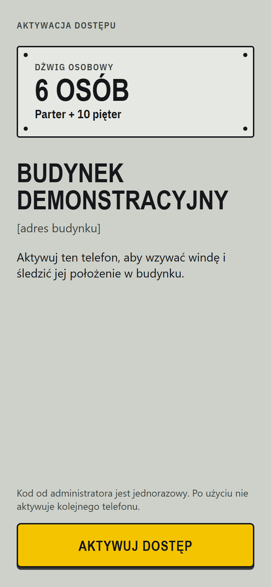 | 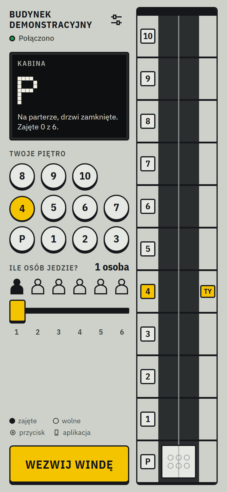 | 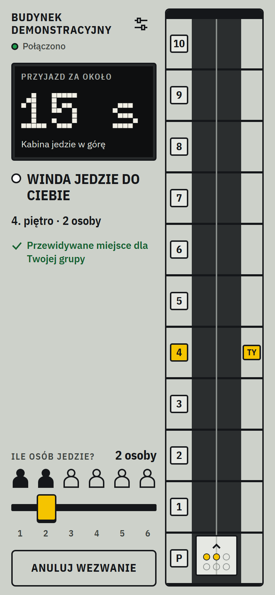 | 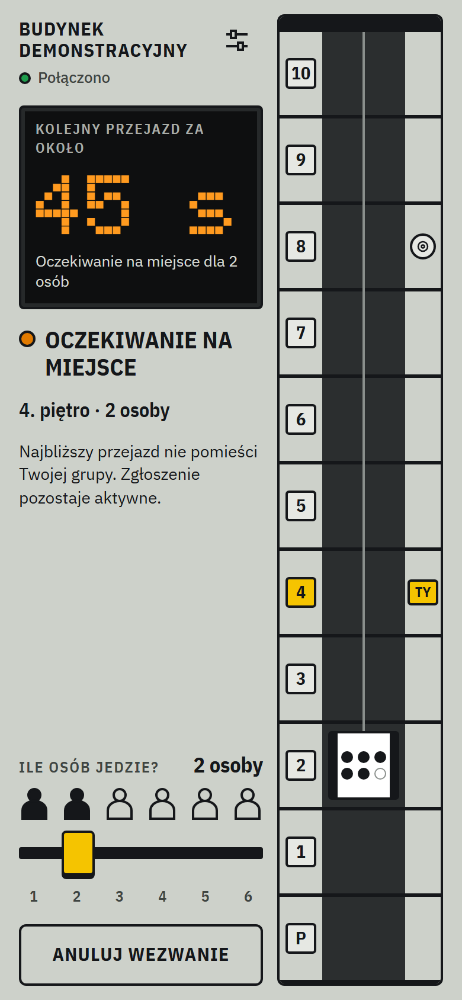 |

| Przyjazd | Awaria | Brak połączenia | Ustawienia |
| :---: | :---: | :---: | :---: |
| 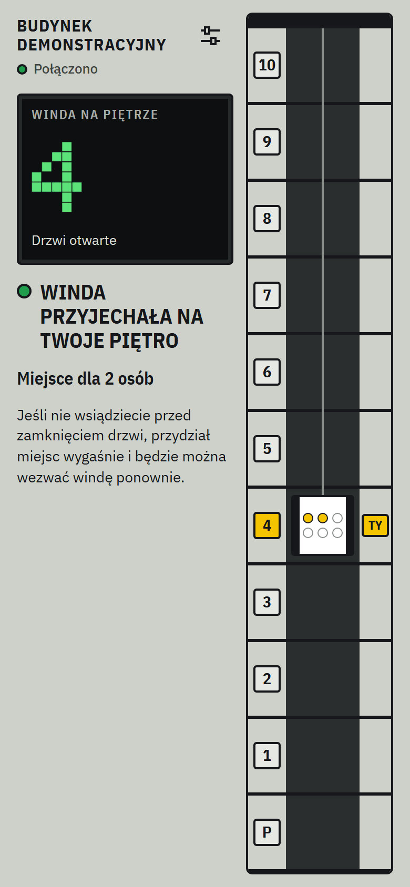 | 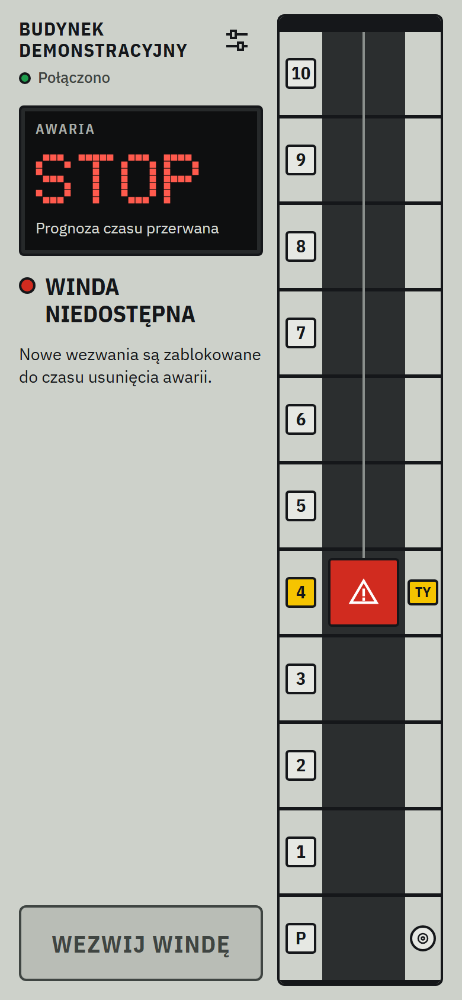 | 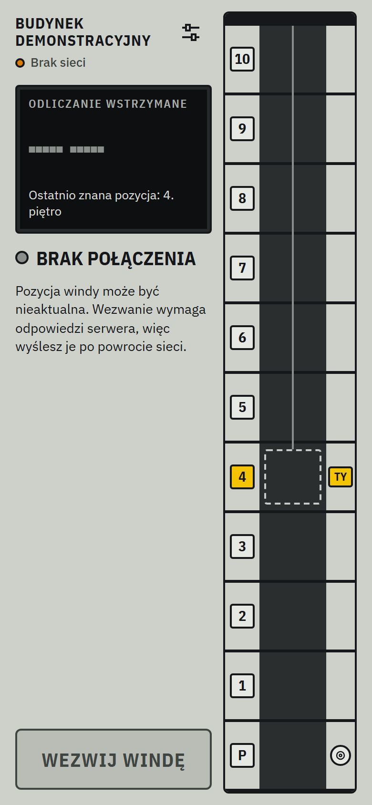 | 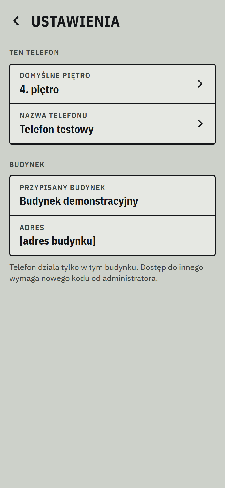 |

### Panel administratora

| Symulator | Kody QR | Telefony |
| :---: | :---: | :---: |
| 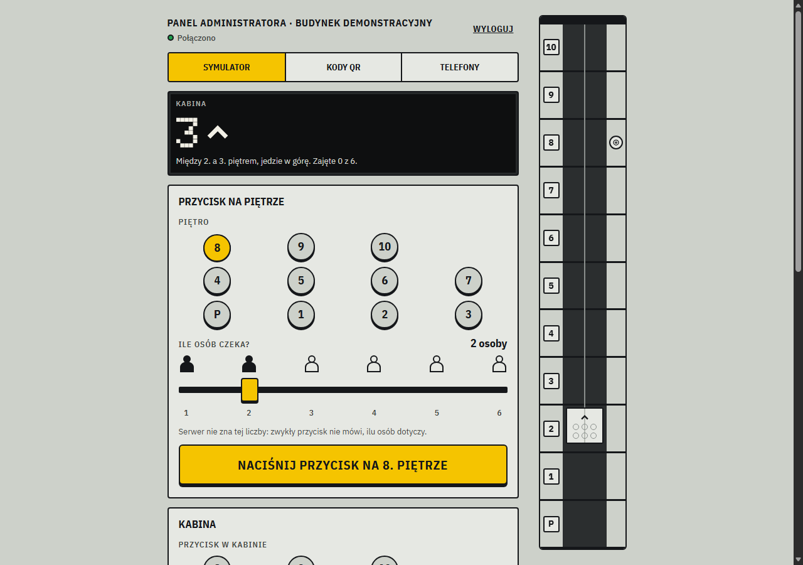 | 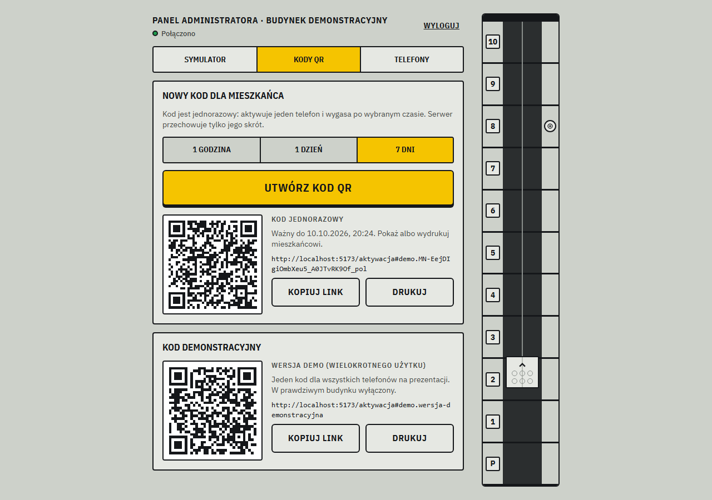 | 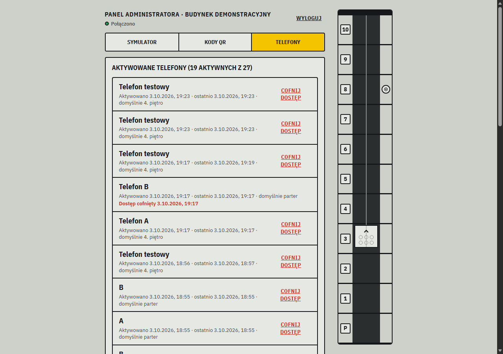 |

## 🔹 Pod maską

Nie poszliśmy na skróty.

```text
 telefon (React) ──HTTP──▶ Cloudflare Worker ──▶ BuildingDO (Durable Object, 1 na budynek)
        ▲                        │                  ├─ engine (czysty TS): kolejka, trasa, przydział grup, ETA
        └──────WebSocket─────────┘                  ├─ symulator windy (te same zdarzenia co adapter sterownika)
 panel administratora ──────────────────────────────▶└─ trwały zapis stanu, wezwań, instalacji i kodów
```

**Frontend.** React + TypeScript. Telefon niczego nie decyduje: wyświetla stan z serwera i płynnie interpoluje ruch kabiny.

**Backend.** Cloudflare Workers + Durable Objects. Jeden obiekt na budynek jest jedynym źródłem prawdy o windzie, a telefony łączą się z nim w czasie rzeczywistym przez WebSockety. Stan jest zapisywany na bieżąco, więc po restarcie obiekt dogania to, co działo się w międzyczasie, zamiast startować od zera.

**Symulator jak prawdziwy sterownik.** Na potrzeby demo zbudowaliśmy symulator windy, który wysyła zdarzenia w tym samym formacie (`ControllerEvent`), którego używałby adapter podpięty do prawdziwego sterownika. Podmiana symulatora na sprzęt nie zmienia reszty systemu.

**Testy.** Logika kolejki, przydziału grup i ETA jest w czystym TypeScripcie (`src/engine`), bez zależności od Cloudflare. Pokrywa ją 40 testów automatycznych w Vitest, do tego skrypty E2E dla API, WebSocketów i przebiegu w przeglądarce.

**Bezpieczeństwo.** Serwer przechowuje tylko skróty SHA-256 tokenów aktywacyjnych i sekretów sesji. Sesje w ciasteczkach `Secure` + `HttpOnly`, weryfikacja `Origin`, limit żądań per IP. Serwer sprawdza uprawnienia przy każdym wezwaniu.

### Budynek demonstracyjny

Parter i piętra 1–10, kabina na 6 osób. Przejazd o jedno piętro trwa 3 s, otwieranie drzwi 2 s, postój 5 s, zamykanie 2 s. Konfiguracja jest w `src/shared/config.ts`.

## Stack

| Warstwa | Technologia |
| --- | --- |
| Frontend | React 19, TypeScript, Vite |
| Backend | Cloudflare Workers (+ Static Assets), Durable Objects, WebSocket |
| Testy | Vitest, skrypty E2E (`scripts/e2e.mjs`, `scripts/ui-flow.mjs`) |

## Uruchomienie lokalne

```bash
npm install
```

Sekrety lokalne trzyma plik `.dev.vars` w katalogu głównym. Jest w `.gitignore` i nie trafia do repo, więc trzeba go utworzyć samemu:

```text
ADMIN_PASSWORD=...
DEMO_ACTIVATION_CODE=...   # min. 20 znaków
```

Następnie:

```bash
npm run dev          # http://localhost:5173
npm test             # testy jednostkowe
npm run typecheck    # sprawdzenie typów
npm run e2e          # test API i WebSocket (przy działającym `npm run dev`)
npm run qr           # kod QR do aktywacji → docs/qr/
```

| Ścieżka | Ekran |
| --- | --- |
| `/aktywacja` | Aktywacja telefonu kodem QR |
| `/` | Ekran mieszkańca: przekrój budynku, wezwanie, ETA |
| `/ustawienia` | Domyślne piętro, nazwa telefonu |
| `/admin` | Panel administratora: symulator, kody QR, telefony |
| `/podglad` | Galeria stanów ekranów (tylko w trybie dev) |

### Wdrożenie na Cloudflare

```bash
npm run cf:login
npm run cf:secret:admin    # ADMIN_PASSWORD
npm run cf:secret:demo     # DEMO_ACTIVATION_CODE
npm run deploy             # build + wrangler deploy
```

## Struktura repo

```text
src/
├─ shared/   # model danych, konfiguracja budynku, protokół, zdarzenia sterownika
├─ engine/   # kolejka, polityka obsługi, przydział grup, ETA, symulator
├─ worker/   # API, Durable Object, autoryzacja, zabezpieczenia
└─ client/   # aplikacja React: ekrany, wizualizacja szybu, połączenie live
tests/       # testy Vitest
design/      # makiety ekranów i tokeny designu
docs/        # dokumentacja, plan, zrzuty ekranu
```

Pełny opis działania: [`docs/dokumentacja.md`](docs/dokumentacja.md). Plan techniczny: [`docs/PLAN.md`](docs/PLAN.md).
